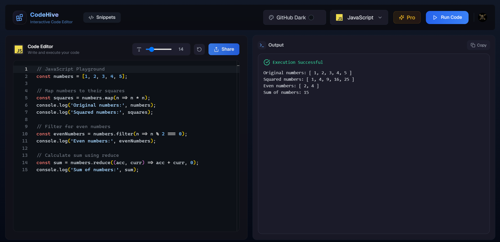

# CodeHive

Code Hive is a powerful online code editor built for seamless collaboration and efficient coding. It enables developers to write, debug, and share code in real-time, making it the perfect hive of creativity for teams and individuals alike.



## 📋 Key Features

- **Stunning UI**: A beautifully designed code editor interface for an enhanced coding experience.

- **Remote Code** Execution: Execute code remotely and get instant output for supported languages.

- **Error Handling**: Clear and concise error messages to debug code effectively.

- **Snippet Management**: Save, store, and share your code snippets effortlessly.

- **Discover Snippets**: Explore and discover shared snippets from global users in the community.

- **Pro Plan**: Unlock additional programming languages and premium features with the Pro subscription.

- **Upcoming Features**: Stay tuned for exciting new features to elevate your coding experience!

## 🛠️ Built With

- [React](https://reactjs.org/)
- [NextJs](https://nextjs.org/)
- [Tailwind](https://tailwindcss.com/)
- [Convex](https://www.convex.dev/)
- [LemonSqueezy](https://www.lemonsqueezy.com/)

## ⚓ Installation

_Follow the following steps to install and setup the virtual environment._

1. Clone the repo
   ```sh
   git clone https://github.com/Samrat-14/code-hive.git
   ```
2. Once inside the cloned repo, get started with installing the node modules.
   ```sh
   npm install
   ```
3. Set the environment variables as per .env.example file provided
4. Start the server for frontend.
   ```sh
   npm run dev
   ```
5. Start the convex server for backend.
   ```sh
   npx convex dev
   ```
6. After the installments are over and the server is running, you can get started with the project.

## 🤝 Contributing

I love contributions, so please feel free to fix bugs, improve things, provide documentation.
If you have a suggestion that would make this better, please fork the repo and create a pull request. You can also simply open an issue with the tag "enhancement".
Don't forget to give the project a star! Thanks again!

1. Fork the Project
2. Create your Feature Branch (`git checkout -b feature/AmazingFeature`)
3. Commit your Changes (`git commit -m 'Add some AmazingFeature'`)
4. Push to the Branch (`git push origin feature/AmazingFeature`)

## 🪪 License

Distributed under the MIT License. See `LICENSE` for more information.

## 🌎 View Demo

Live Demo: [https://samrat-codehive.vercel.app/](https://samrat-codehive.vercel.app)

## 📞 Contact

Your Name - [Samrat Sadhu](https://samrat-sadhu-portfolio.vercel.app/) - ss2414@ece.jgec.ac.in
